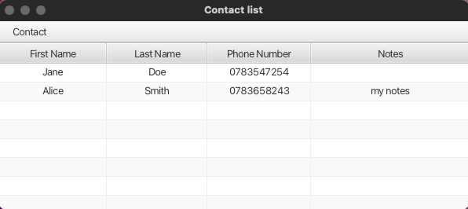
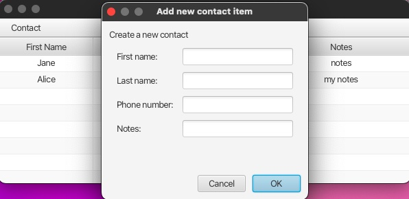
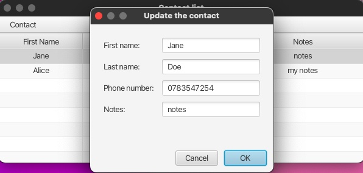

# Contacts - JavaFX Phone book Application

This is a basic JavaFX phone book application, created to show my knowledge of JavaFx.

## Description

This application stores contacts in a file and shows them.



The user can also add a new contact, update or delete a contact.





## Installation

1. Clone this repository to your local machine:

 ```shell
    https://github.com/marinescu97/Contacts.git
 ```

2. Run Application.java file:

- Open the project in your preferred Java IDE.
- Run the `Application.java` file located in the `src/main/java/com/marinescu/contacts` directory.
- Follow the on-screen instructions to interact with the Contacts application.

## Technologies

- **Java 19**: Java 19 is the primary programming language, known for its strong performance and compatibility features. It ensures a reliable base for the app's backend logic and functions.
- **JavaFX**: JavaFX is used to create the dynamic and engaging user interface. It allows for the development of a responsive and visually attractive desktop app.

## License

The Contacts application is distributed under the [MIT License](https://opensource.org/license/mit).
